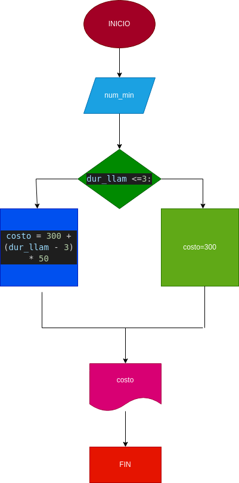

# llamada_telefonica

ingresar el tiempo de duracon que duracion de una llamada telefonica y determinar la cantidad a pagar deacuerdo con lo siguiente:
- toda llamada durante 3 minutos o menos tiene costo de 300 pesos
- cada minuto adicional cuesta 50 pesos 
# DISEÑO

## Diagrama de flujo

